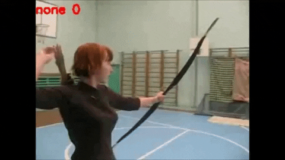
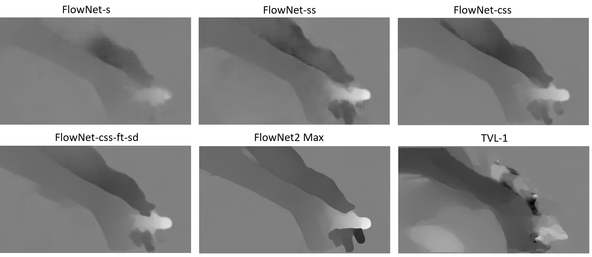

[](LICENSE)
# I3D Finetune with FlowNet 2.0 Docker Image

This repository contains a Dockerfile to run neural networks for optical flow estimation in Docker containers and the I3D Finetune architecture for action recognition. It contains scripts for **training**, **testing** and **live inference**. 

### Run a video or live stream from your camera or file system to get the current action class

</img> </img> </img> 

## 0. Requirements

We use [nvidia-docker](https://github.com/NVIDIA/nvidia-docker#quick-start) for reliable GPU support in the containers. This is an extension to Docker and can be easily installed with just two commands.

To run the FlowNet2 networks, you need an Nvidia GPU (at least Kepler). For the smaller networks (e.g. *FlowNet2-s*) 1GB of VRAM is sufficient, while for the largest networks (the full *FlowNet2*) at least **4GB** must be available. A GTX 970 can handle all networks.

I3D Finetune Network for training, testing and live inference worked with:

* python 2.7 (Not working with python 3.x)
* Opencv 4.2
* Tensorflow 1.15
* dm-sonnet 1.36
* Pillow 6.2.2
* sk-learn 0.20.4
* Pandas 0.24.2

you can install the requirements with

> $ pip install -r requirements.txt

## 1. Building the FN2 Docker image


Simply run `make`. This will create two Docker images: The OS base (an Ubuntu 16.04 base extended by Nvidia, with CUDA 8.0), and the "flownet2" image on top. In total, about 8.5GB of space will be needed after building. Build times are a little slow. Maybe you have to run `sudo make`.

Make sure you have read/write rights for the current folder. Run the `run-network.sh` script. It will print some help text, but here are two examples to start from:

### 1.1 Optical flow for two single images
- we use the full *FlowNet2* variant for maximum accuracy
- we assume that we are on a single-GPU system
- we want debug outputs, but not the whole network stdout

> $ ./run-network.sh -n FlowNet2 -v data/example/0000000-imgL.png data/example/0000001-imgL.png flow.npy

### 1.2 Optical flow for entire lists of images
- we use the lean *FlowNet2-s* variant for maximum speed
- we want to use GPU "0" on a multi-GPU system
- we want to see the full network stdout printfest

> $ ./run-network.sh -n FlowNet2-s -g 0 -vv data/example/flow-first-images.txt data/example/flow-second-images.txt data/example/flow-outputs.txt

See the [paper website](https://lmb.informatik.uni-freiburg.de/Publications/2017/IMKDB17) for more details.

## 2. Preprocessing Data
In this section we describe the preprocessing for the I3D-Finetune model.
## 2.1 Generate RGB and Flow images
Copy your videos in data/origin and split up your videos in data/origin/train and data/origin/test. The file structure will be used in the preprocessed directory. Run the following command to generate rgb and flow images for training with the FlowNet2 mode "css-ft-sd" on 3 threads:

> $ python preprocess_gpu_flownet.py rgbflow FlowNet2-css-ft-sd 3

Parameters of `preprocess_gpu_flownet.py mode variant threads`:
- mode: rgb, flow or rgbflow 
- variant: FlowNet2, FlowNet2-s, FlowNet2-ss, FlowNet2-css, FlowNet2-css-ft-sd or FlowNet2-CSS
- threads: int (amount of threads)

The script will generate a new directory in data with all RGB and Flow Frames. You can adjust the origin and save location in the script. 

**Note: If you use more than 1 thread it will probably break your terminal. Restart your session should fix it.**

## 2.2 Generate list files
The I3D model needs 4 files for training:

- Trainlist: lists the videos and classes for training
- Testlist: lists the videos and classes for testing
- RGBlist: lists the paths to RGB images
- Flowlist: lists the paths to Flow images

Run the following command to generate these lists from your generated RGB and Flow images:

> $ python create_files.py ucf101 FlowNet2-css-ft-sd

Parameters of `create_files.py dataset variant`:
- dataset: name of the dataset (name of directory) e.g. ucf101
- variant: FlowNet2, FlowNet2-s, FlowNet2-ss, FlowNet2-css, FlowNet2-css-ft-sd or FlowNet2-CSS

It will generate the above files in data/ucf101. You can adjust the origin and save location in the script. 

## 3. Training

To train the Model in mixed mode run

> $ sh start_training_finetune_mixed.sh

It will save models which exceeds the given threshold in `finetune.py` in /out. You can modify the training process in `finetune.py` (Global variables) and with the parameters of 
`finetune.py dataset mode variant split`:

- dataset: name of the dataset (name of directory) e.g. ucf101
- mode: flow, rgb or mixed
- variant: FlowNet2, FlowNet2-s, FlowNet2-ss, FlowNet2-css, FlowNet2-css-ft-sd or FlowNet2-CSS
- train and testlist splits: 1 (use more than 1 if you have more than 1 test and train split)

See start_training_finetune_mixed.sh as example.

**Note: Make sure it's using GPU and not CPU. If its very slow it's probably on CPU and you should fix your cuda environment. Look at Section 6.**

## 4. Testing

Change the path in `test.py` to your rgb and flow models and then run

> $ sh start_test.sh

It will save the logs to /output. You can modify the testing process in `test.py` (Global variables) and with the parameters of 
`test.py dataset mode variant split`:

- dataset: name of the dataset (name of directory) e.g. ucf101
- mode: flow, rgb or mixed
- variant: FlowNet2, FlowNet2-s, FlowNet2-ss, FlowNet2-css, FlowNet2-css-ft-sd or FlowNet2-CSS
- train and testlist splits: 1 (use more than 1 if you have more than 1 test and train split)

See start_test.sh as example.

**Note: Make sure it's using GPU and not CPU. If it's very slow it's probably on CPU and you should fix your cuda environment. Look at Section 6.**

## 5. Live Inference

Change the path in `live_inference.py` to your rgb and flow models and run 

> $ sh start_live_inference.sh

It will save the logs to /output. You can modify the live inference process in `live_inference.py` (Global variables) and with the parameters of 
`live_inference.py dataset mode variant workers inference`: 

- dataset: name of the dataset (name of directory) e.g. ucf101
- mode: flow, rgb or mixed
- variant: FlowNet2, FlowNet2-s, FlowNet2-ss, FlowNet2-css, FlowNet2-css-ft-sd or FlowNet2-CSS
- workers: parallel threads for running FlowNet2
- inference: amount of frames for each prediction

See start_live_inference.sh as example.

You can quit the live stream and stop the script by pressing the key 'q' in the live-preview window. 

**Note: Global Variable _GPU_FRACTION in `live_inference.py`: amount of GPU fraction (Don't use 1 because FlowNet2 and I3D run in parallel)**

**Note: Make sure it's using GPU and not CPU. If it's very slow it's probably on CPU and you should fix your cuda environment. Look at Section 6.**

## 5.1 Videofile Inference instead of live stream
Change these lines in `live_inference.py` for processing a videofile (.avi, .mp4, ...) instead of a live stream:

> #Run video examples<br>
> #video_path = './data/example/_Archery_g01_c01.avi'<br>
> #video_path = './data/example/_BoxingPunchingBag_g01_c01.avi' <br>
> #video_path = './data/example/_JugglingBalls_g01_c02.avi' <br>
>
> #Run camera <br>
> video_path = 0<br>

## 6. Troubleshooting

If cuda is not working properly make sure it is installed correctly and the path to the libraries is working:

> export LD_LIBRARY_PATH=$LD_LIBRARY_PATH:/usr/local/cuda-10.0/lib64/

Add this to bashsrc for a constant solution.

**Note: FlowNet2 is only working in the installed directory!**

## 7. More information

See [FlowNet2](https://github.com/lmb-freiburg/flownet2-docker), [I3D Deepmind](https://github.com/deepmind/kinetics-i3d) and [I3D Finetune](https://github.com/USTC-Video-Understanding/I3D_Finetune) for more details.

## 7.1 Further explanation of list files
We use list files in /data/datasetname subdir to make the code find RGB images and flow data saved on disk. You have to adapt the list files to make sure the list files contain the right path to your data. Each line in `rgb.txt` (RGBlist) should be in the format:
```bash
dir_name_of_imgs_of_a_video /path/to/img_dir num_imgs label
```
For example, if your RGB data of ucf101 is saved in /data/ucf101/rgb, and there are 13320 subdirs in this folder, each subdir contains images from a video. If in subdir `v_BalanceBeam_g14_c02`, there are 96 images, and the ground truth of this video is 4, then the line for this subdir is:
```bash
v_BalanceBeam_g14_c02 /data/ucf101/rgb/v_BalanceBeam_g14_c02 96 4
```
Similarly, update `data/ucf101/flow.txt` (Flowlist) for flow data. **Note: we use one file to include x and y part of flow data, so we use `{：s}` in each line to placehold `x` or `y` in the data path.** For example, if your flow data are placed like this:
```bash
|---flows
|   |---x
|   |--- y
```
then you can write each line in `flow.txt` like this:
```bash
v_BalanceBeam_g14_c02 data/ucf101/flow/{:s}/v_BalanceBeam_g14_c02 107 2
```
i.e, use `{:s}` replace `x` or `y` in path.

Trainlist and Testlist are in the following format:

```bash
/path/to/video label
```

`label_map.txt` contains the labels of different classes. Each line corresponds to the classname and the linenumber to the numeric class value:
```bash
ApplyEyeMakeup -> numeric class value 0
ApplyLipstick -> numeric class value 1
Archery -> numeric class value 2
```

If you are confused, please refer our code to see data loading details.

## 7.2 FlowNet2 Evaluation
The table shows the performance and GPU usage for an example video with 500 frames of each FlowNet2 mode compared to the TVL-1 algorithm:

Method |      Frames     |    Time  | Time per frame | FPS | GPU Usage
-------------- | ------------ | ---------|----------|----------|----------
FlowNet-s      |     500     |    29.2s  | 0.06s | 16 | 425MB
FlowNet-ss      |     500     |    37.87s  | 0.07s | 14 | 579MB
FlowNet-css      |     500     |    49.87s  | 0.1s | 10 | 771MB
FlowNet-css-ft-sd      |     500     |    49.72s  | 0.1s | 10 | 771MB
FlowNet-CSS      |     500     |    78.52s  | 0.16s | 8 | 1.4GB
FlowNet (Max)      |     500     |    159.57s  | 0.32s | 3 | 2.4GB
TVL-1 (CPU)      |     500     |    647.27s  | 1.3s | 0.8 | -

Quality of different FlowNet2 modes and TVL-1 using the example of washing hand:




## 8. License
The files in this repository are under the [GNU General Public License v3.0](LICENSE)

Some explanations of the readme come from the original [FlowNet2 Repository](https://github.com/lmb-freiburg/flownet2-docker) and [I3D Finetune Repository](https://github.com/USTC-Video-Understanding/I3D_Finetune).

## 9. TODOs

- [x] add real live inference script
- [x] add images of different flownet2 modes (qualitative comparison)
- [x] add live prediction to preview window 
- [x] improve console output for predictions
- [x] improve thread waiting solution for live inference when threads are done
- [x] add inference mode rgb and flow mode (currently only mixed mode is available)
- [ ] setting file for paths, training parameter and so on (improve usability)
- [ ] improve performance of live inference
- [ ] improve training process with validation set and kfold validation
- [ ] python3 compatibility

